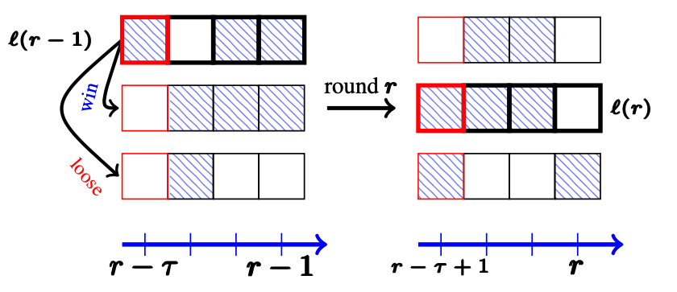

# LB-SDA

# Description

Code for the ICML 2021 "On Limited-Memory Subsampling Strategies for Bandits" paper.
The article is joint work with Dorian Baudry and Olivier Cappé.

Here, the `LB-SDA-LM` and `SW-LB-SDA` algorithms from the paper are implemented.

The empirical performance of the algorithms are reported in the different notebooks in the [notebook](Notebooks/) folder.

# Contact
Please contact yoanrussac@ens.fr for any further information.
